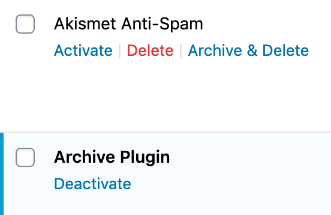
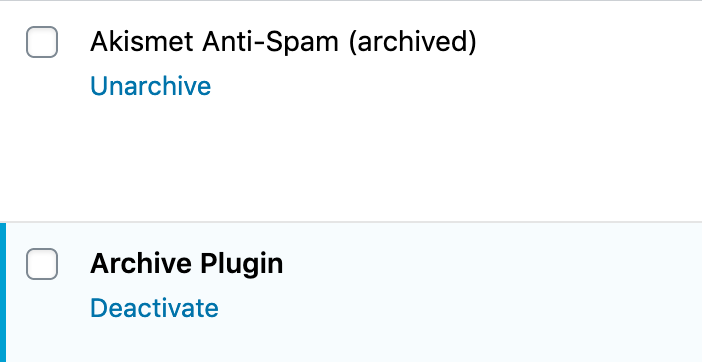
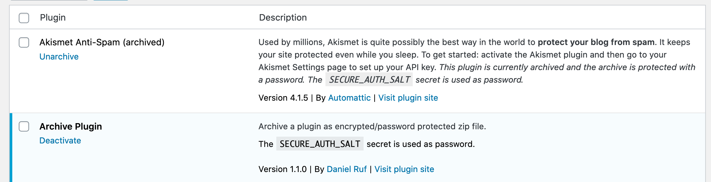

# WordPress Archive Plugin

**Always create a backup before using this plugin**

This plugin allows you to archive inactive plugins.

## Archiving a plugin:

* Click "Archive & Delete" to start the archive process
* The plugin files are compressed as archive
* A placeholder file is created with the original plugin information

## Unarchiving a plugin:

* Click "Unarchive" to start the unarchive process
* The archive is uncompressed
* The placeholder file is deleted

The password for the archive is the value of the `SECURE_AUTH_SALT` constant.

## Disclaimer

This plugin works for me in a few small tests cases without any issues. As there is no feedback from other users and so it is not widely battle-tested it is wise to test the functionality and create a backup before using it.

## Screenshots

### Plugin list view

### Archived plugin

### Placeholder file with new description
